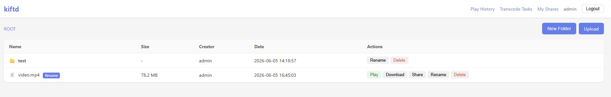
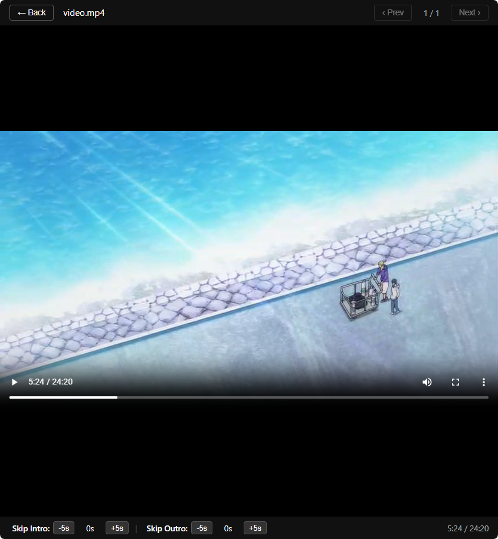
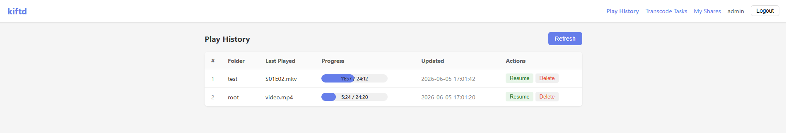
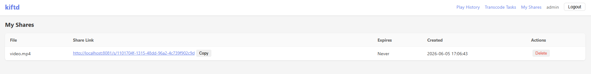
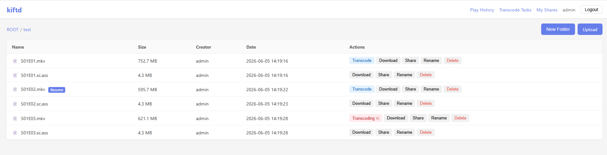
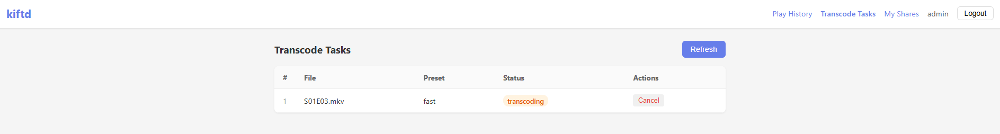

# kiftd-cpp

**Lightweight Personal File Server · Optimized for Online Playback**

A lightweight file server built with C++17 and SQLite, inspired by [kiftd](https://github.com/KOHGYLW/kiftd). Extends the original file server with deep online video playback optimizations — ideal for personal NAS, home media libraries, and small-scale file sharing.

> 📖 [中文](README.md)

## Why kiftd-cpp

### vs Jellyfin — Smooth Playback on Low-End Hardware

Jellyfin uses **live transcoding** — it transcodes video in real-time during playback, which demands significant CPU/GPU power. Low-end servers (NAS, old PCs) often struggle with buffering and stuttering.

kiftd-cpp uses a **transcode cache** approach: videos are pre-transcoded to browser-friendly MP4 (H.264) in the background. During playback, the cached file is served directly with **zero real-time encoding overhead**.

| | Jellyfin (Live Transcode) | kiftd-cpp (Transcode Cache) |
|--|---|---|
| CPU usage during playback | High (continuous encoding) | Near zero |
| Experience on low-end hardware | Buffering, stuttering | Smooth playback |
| Disk space | No extra space | Cache uses space (deletable after watching) |
| Hardware acceleration | Required for smooth playback | Optional — works fine without GPU (background transcode) |

- **Space for time** — background pre-transcoding, zero playback overhead, works great on low-end hardware
- **Cache is controllable** — delete cached files after watching, no long-term storage commitment
- **Auto-cache next episode** — while watching the current episode, the next one starts transcoding automatically for seamless switching
- **Optional hardware acceleration** — supports CPU / NVIDIA NVENC / Intel QSV / AMD AMF; faster with a discrete GPU, fully usable without one

### vs kiftd — Better Online Playback

kiftd is an excellent file server, but its online playback capabilities are basic. kiftd-cpp retains full file server functionality while adding deep optimizations for the "watching shows" experience:

- **Play history** — automatically remembers playback position per file within the same folder, perfect for binge-watching — pause anytime, resume anytime
- **Previous / Next episode** — switch episodes directly from the player without going back to the file list
- **Skip intro / outro** — configurable skip durations, automatically applied to every episode
- **Dedicated play page** — immersive playback with keyboard shortcuts (Space to pause, Arrow keys to seek, F for fullscreen)
- **Transcode task management** — visual queue view, cancel tasks, adjust priorities

### Effortless Deployment

- **Native C++** — no Java runtime dependency, single exe runs directly
- **Only prerequisite** — Windows needs [VC++ Redistributable](https://learn.microsoft.com/cpp/windows/latest-supported-vc-redist) (most PCs already have it)
- **SQLite database** — zero configuration, data is just a file, backup/migration is just copying a folder
- **No external dependencies** — no Redis, MySQL, or Docker needed. Just run it.

## Features

- File management — upload/download, folder tree, rename, delete, preview (text + images)
- Video playback — built-in player, keyboard shortcuts, episode switching, progress tracking
- Video transcoding — FFmpeg integration, four transcode profiles (CPU/NVENC/QSV/AMF), queue management, configurable quality presets
- Play history — auto-record progress, auto-play next episode, skip intro/outro
- File sharing — generate public download links, no login required to download
- Security — double SHA256 password hashing, login failure lockout, cookie sessions

## Screenshots

### File Browser



### Video Player



### Play History



### Share Management



### Video Transcoding



### Transcode Task Management



## Quick Start

### Prerequisites

- CMake 3.20+
- C++17 compiler (MSVC 2019+ / GCC 9+ / Clang 10+)
- Node.js 18+ (for frontend build)
- FFmpeg (optional, for video transcoding)

### Build

```bash
# Backend (no network required, all deps in third_party/)
cmake -B build -S .
cmake --build build --config Release

# Frontend
cd web
npm install
npm run build
cd ..
```

One-click build on Windows:

```bash
build.bat          # build only
package.bat         # build + create release zip
```

### Run

```bash
# Default (port 8080)
./build/kiftd

# Custom options
./build/kiftd -p 9090 -d /path/to/data -w /path/to/web/dist
```

Open http://localhost:8080 — default account: `admin` / `admin`

## Configuration

See [doc/CONFIG.md](doc/CONFIG.md) for full configuration reference.

Key settings in `data/config.json`:

```json
{
  "port": 8081,
  "accounts": [{ "username": "admin", "password": "admin" }],
  "ffmpeg_path": "",
  "transcode_concurrency": 2,
  "transcode_profile": "cpu",
  "auto_transcode_next": false,
  "play_progress_threshold": 90
}
```

## Documentation

| Document | Description |
|----------|-------------|
| [Architecture](doc/ARCHITECTURE.md) | System architecture and module design |
| [Build Guide](doc/BUILD.md) | Detailed build instructions |
| [Configuration](doc/CONFIG.md) | All configuration options |
| [Dependencies](doc/DEPENDENCIES.md) | Third-party library list |
| [API Reference](doc/API.md) | REST API endpoints |

## Tech Stack

**Backend:** C++17 / Crow / SQLite3 / Asio / nlohmann-json

**Frontend:** Vue 3 / TypeScript / Vite / Vue Router / Pinia / Axios

## API Overview

| Method | Path | Description |
|--------|------|-------------|
| POST | `/api/auth/login` | Login |
| GET | `/api/folders/:id` | Folder contents |
| POST | `/api/files/upload` | Upload file |
| GET | `/api/files/:id/download` | Download file |
| POST | `/api/shares` | Create share link |
| GET | `/s/:share_id` | Public download (no auth) |
| POST | `/api/transcode/:fileId` | Submit transcode task |

Full API docs: [doc/API.md](doc/API.md)

## Migration

Copy the entire `data/` directory to the new location:

```bash
cp -r data/ /new/server/data/
./build/kiftd -d /new/server/data
```

## License

MIT
